#Just testing how to make a README

#  Plataforma de Cursos Online (Django)

##  Sobre o projeto

Este projeto consiste em uma aplicação web simples desenvolvida com Django, com foco em praticar conceitos de backend em Python.

A aplicação simula uma plataforma de cursos online, onde o administrador pode gerenciar os cursos disponíveis no site.

---

##  Funcionalidades
 
* Sistema de autenticação (registro e login de usuário)
*  Visualização de cursos cadastrados
*  Edição de cursos (título, descrição e duração)
*  Cadastro de novos cursos
*  Exclusão de cursos existentes

>  Observação: O sistema foi projetado para uso administrativo (não há múltiplos níveis de usuário).

---

##  Tecnologias utilizadas

* Python
* Django
* SQLite (banco de dados padrão do Django)

---

##  Dependências

Instale as bibliotecas necessárias com:

```bash
pip install -r requirements.txt
```

###  Bibliotecas utilizadas no projeto:

```
# Django==6.0.3
```

---

##  Configuração do banco de dados

Execute as migrações:

```bash
python manage.py migrate
```

---

##  Criar superusuário (admin)

Opcional

```bash
python manage.py createsuperuser
```

---

##  Rodar o servidor
Terminal:
```bash
python manage.py runserver
```

Acesse no navegador:

```
http://127.0.0.1:8000/
```

---

##  Observações

* Este projeto tem fins educacionais.
* Pode ser expandido futuramente com:

  * sistema de usuários comuns
  * matrícula em cursos
  * upload de vídeos/aulas

---

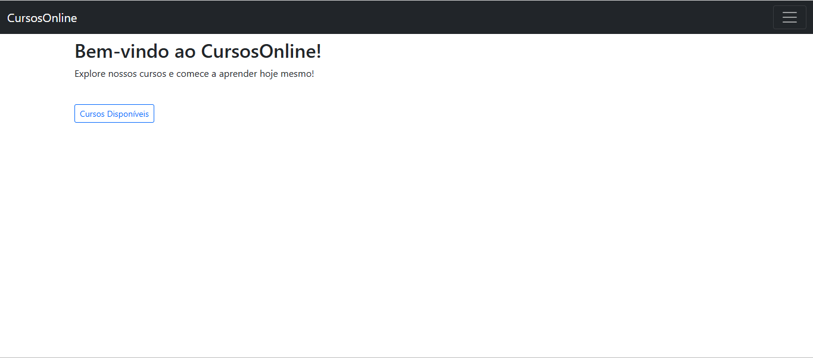
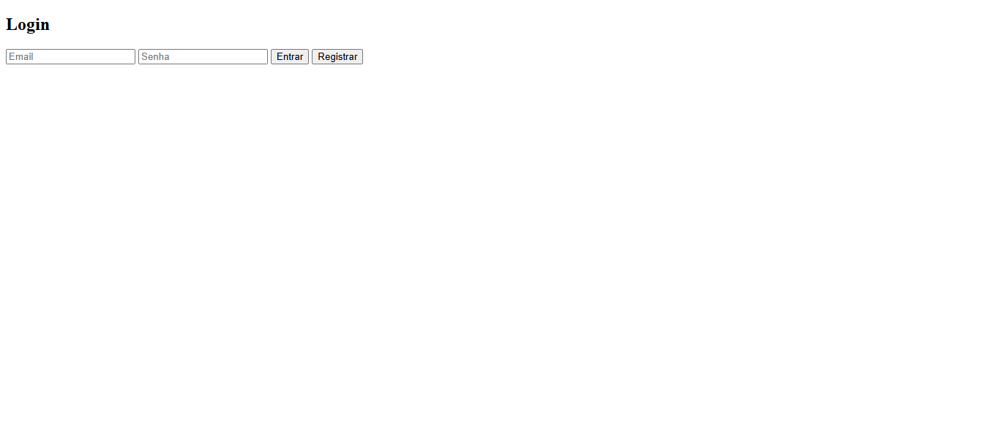
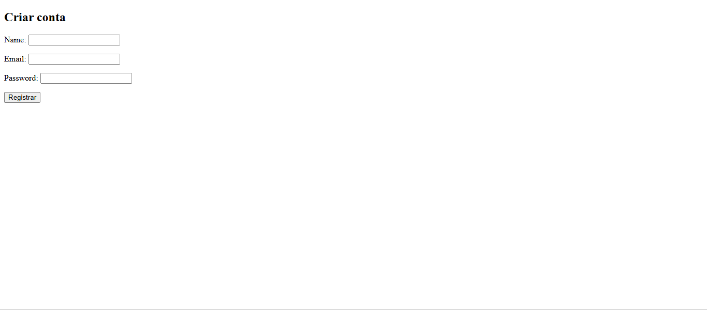
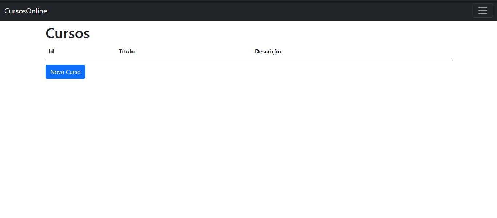
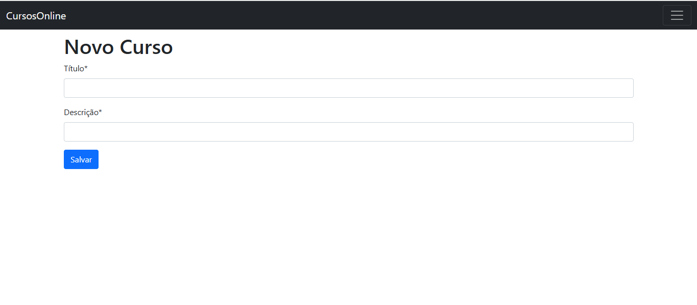
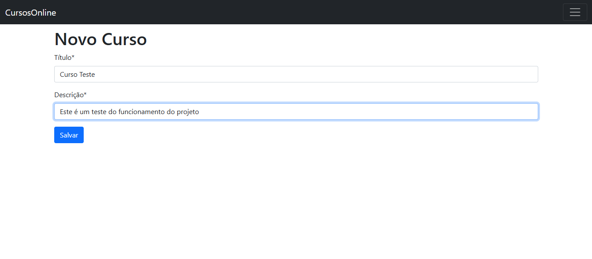
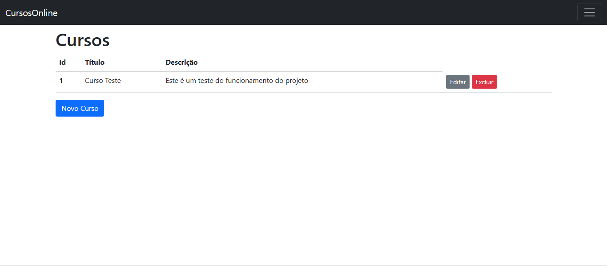
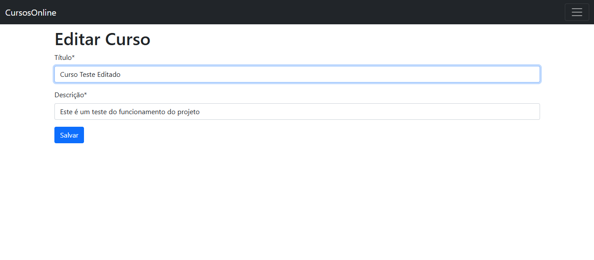
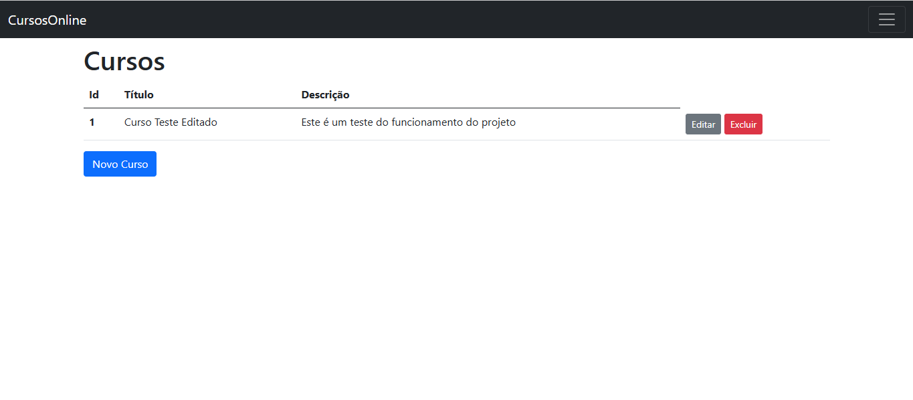
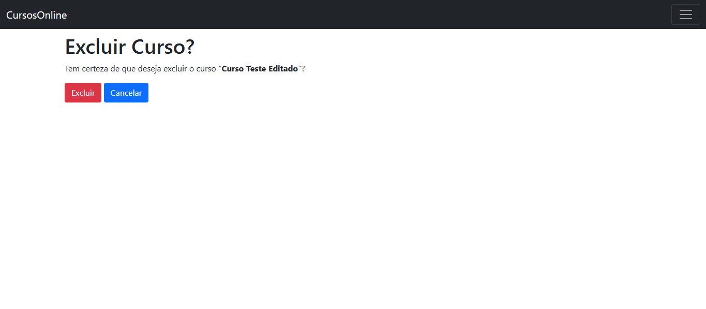

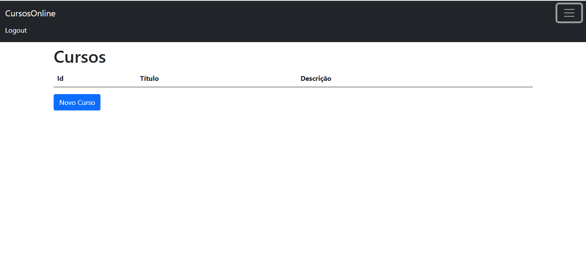

##  Autor

Desenvolvido por mim, com o propósito educacional de estudar e aplicar algumas relações entre a linguagem python e o framework Django 😄
